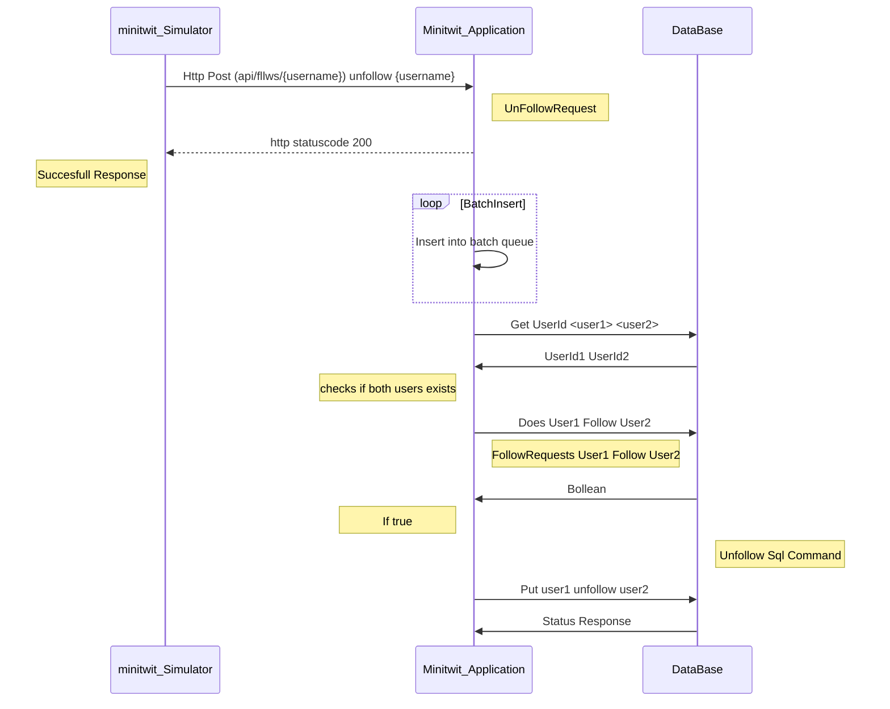
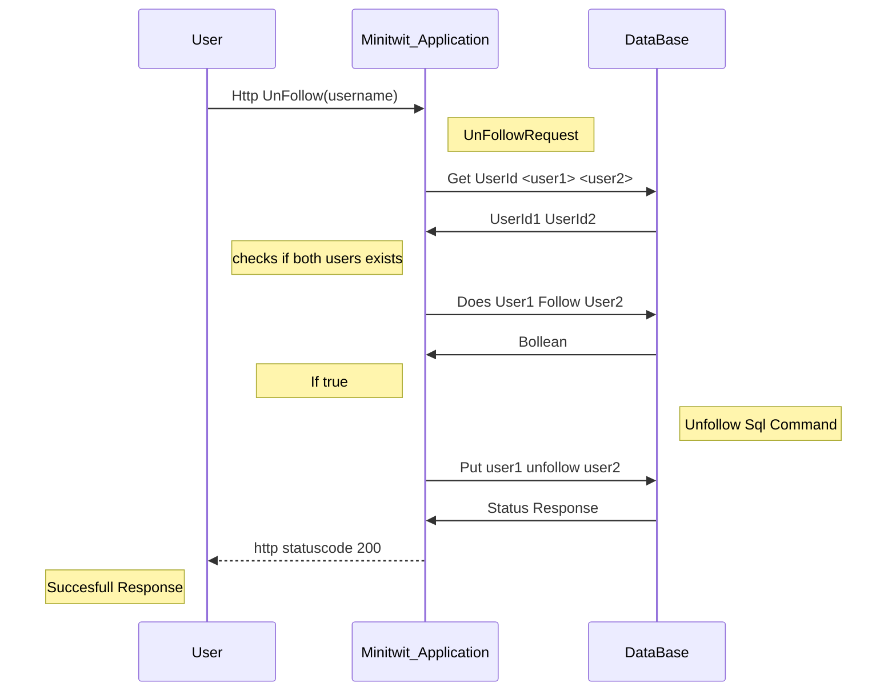

# Project Documentation Template

## Table of Contents
1. [Introduction](#introduction)
2. [Project Structure](#project-structure)
3. [Installation](#installation)
4. [Usage](#usage)
5. [Configuration](#configuration)
6. [Testing](#testing)
7. [Deployment](#deployment)
8. [Contributing](#contributing)
9. [License](#license)
10. [Acknowledgments](#acknowledgments)
11. [System Architecture](#systemarchitecture)

---

# System's Perspective

## Design and Architecture

## Dependencies

## Interactions of Subsystems

## Current State of the System

# Process' perspective

## Deployment and Release

## Monitoring

## Logging

## Security Assessment

## Strategy for Scaling and Upgrades

## The use of AI

# Reflection Perspective

## Evolution and Refactoring

## Operation

## Maintanence

## DevOps


# Introduction
Provide a brief overview of the project, its purpose, and key features.

# Project Structure
Explain the directory structure and the purpose of each folder/file.

```
/itu-minitwit
    ├── .github/
    │   └── workflows                       # GitHub Action workflows
    │       ├── build-and-test.yml          # Automated build and test
    │       ├── build-release.yml           # Creates release on push with a tag
    │       ├── continous-deployment.yml    # Deployment to dig
    │       ├── lint-and-format-check.yml   # Automated linter and formatting checks
    │       ├── scheduled-release.yml       # Automated weekly release
    │       └── sonarcube.yml               # Automated Sonarcube checks
    ├── logging/                            # Logging configuration files
    │        ├── docker-compose.yml         # Starts ELK stack and nginx containers
    │        └── nginx.conf                 # Reverse proxy with authentication
    ├── logstash/                           # Logstash configuration
    ├── remote_files/                       # Files used remotely on the minitwit server for deployment
    ├── report/                             # Report files
    ├── src/                                # Source code
    │   ├── minitwit.core/                  # Domain Layer - Domain models
    │   ├── minitwit.infrastructure/        # Infrastructure Layer - Data access
    │   └── minitwit.web/                   # Presentation Layer - Web app & API entry point
    │       └── Program.cs                  # Program entrypoint
    ├── terraform/                          # Terraform configurations for provisioning
    │   ├── files/                          # Files used by terraform
    │   ├── modules/
    │   │   ├── minitwit_logging/           # Terraform code for logging infrastucture
    │   │   └── minitwit_server/            # Terraform code for minitwit infrastucture
    │   ├── main.tf                         # Terraform module definitions
    │   ├── terraform.tfvars                # Terraform variables
    │   └── variables.tf                    # Terraform variables declarations
    ├── tests/                              # Test cases
    │   └── minitwit.tests/
    │       ├── minitwit.tests.cs           # API tests
    │       └── playwright.test.cs          # UI tests
    │
    ├── docker-compose.yml                  # For running the program locally
    ├── Dockerfile                          # Application Dockerfile
    └── itu-minitwit.sln                    # Project solution file
```

## Installation
Step-by-step guide on how to set up the project locally.

```bash
# Clone the repository
git clone https://github.com/Docker-Daze/itu-minitwit.git

# Navigate to the project directory
cd itu-minitwit

# Install dependencies
dotnet restore
dotnet build

# Apply database migrations
dotnet ef database update
```

## Usage

The deployed the application accessible on "http://164.90.240.84:5000/public" How to deploy the application is mentioned in the deployment section.

The other ports running for monitoring and logging on the deployed app:
- Promethous is on "164.90.240.84:9091"
- Grafana is on "164.90.240.84:3000"
- elasticsearch is on "209.38.112.21:9200"
- logstach is on "209.38.112.21:5044"
- kibana is on "209.38.112.21:5601"
- nginx is on "209.38.112.21:8080"

It requires a login to access monitoring and logging.             
For Grafana "164.90.240.84:3000" you can use the given login to access the dashboard.
For elasticsearch "209.38.112.21:8080" use "admin" "admin" to login and access logs. 

Run the application locally
To run the application locally use this command inside the root folder itu-minitwit:
```bash
# Command to run the project
docker compose up --build
```

When the minitwitimage service is built and all containers are created, then the application is up and running on "localhost:5114/". To access the application, navigate to "localhost:5114/" in the browser.

You can use the applications features like creating an account and post on the public timeline.

The ports for monitoring and logging is also accessible locally.
- Promethous is on "localhost:9091"
- Grafana is on "localhost:3001"
- elasticsearch is on "localhost:9200"
- kibana is on "localhost:5601"

Note that no data and Grafana dashboard are set up locally.

## Configuration
Details about configuration files and environment variables.

# Process Perspective

This perspective should clarify how code or other artifacts come from idea into the running system and everything that happens on the way.

In particular, the following descriptions should be included:

## Description of stages and tools included, including deployment and release of your systems.


## Monitoring of application

The application utilizes Prometheus and Grafana for monitoring. Prometheus scrapes port 5000, and sends the data to the /metrics endpoint.
Then Grafana retrieves the data from /metrics, and uses this as its data source. The relevent information could however not be found in the default configs .
In the `MetricsService.cs` file, there are custom metrics to our application, such as the "minitwit_follow_counter and "app_request_duration_seconds"
The follow counter is implemented in the program by adding to the counter, every time a follow request is made.
The duration is measured by starting a timer when a request comes in, and stopping it when the request has been processed.

## Logging of application

The application uses the ELK logging stack. In the beginning, the logs contained information from the information level and up.
This resulted in a flood of logs, and it was impossible to see anything relevant. It was then configured to only show warnings and above.
Here there were practically no logs. From here logging statements were added to the code, to log when problems occured.
In the `ApiController.cs` there are custom creation of logs which are logged as warnings. 
These logs include system failures such as unsuccessfull message post and failure to follow a user.
This data is sent through Serialog to Logstash.

## Security assessment

## Strategy for scaling and upgrade

  - A complete description of stages and tools included in the CI/CD chains, including deployment and release of your systems.
  - How do you monitor your systems and what precisely do you monitor?
  - What do you log in your systems and how do you aggregate logs?
  - Brief results of the security assessment and brief description of how did you harden the security of your system based on the analysis.
  - Applied strategy for scaling and upgrades.


## CI/CD Chains
Our CI/CD Pipelines are built for the purpose of easier maintainess and security of our deployment to servers. ensureing that our infrastructure are up regardless of maintainess or failures for newly pushed commits.

``` 
/root
    ├── workflows
        ├── build-and-test.yml
        ├── build-release.yml
        ├── continous-deployment.yml
        ├── lint-and-format-check.yml
        ├── scheduled-release.yml
        └── sonarcube.yml
```

The following workflows are implemented to ensure a robust CI/CD pipeline:

1. **Build and Test Workflow**  
    This workflow automates the build process and runs all unit and integration tests to ensure code quality.

2. **Build Release Workflow**  
    Automatically creates a release when a new tag is pushed to the repository.

3. **Continuous Deployment Workflow**  
    Deploys the application to the production server upon successful completion of tests and builds.

4. **Lint and Format Check Workflow**  
    Ensures that the code adheres to the project's linting and formatting standards.

5. **Scheduled Release Workflow**  
    Automates weekly releases to ensure regular updates and maintenance.

6. **SonarQube Workflow**  
    Performs static code analysis using SonarQube to identify potential bugs and vulnerabilities.

Each workflow is defined in the `.github/workflows` directory and is triggered based on specific events such as pushes, pull requests, or scheduled intervals.

### Deployment Chain
The deployment process follows a structured chain format to ensure reliability and minimize downtime. The steps are as follows:

1. **Linting and Code Quality Checks**  
    The code is first analyzed for adherence to linting and formatting standards. This ensures that the codebase remains clean and maintainable.

2. **Integration Testing**  
    Once the linting checks pass, the commit undergoes rigorous integration testing to validate that all components work together as expected.

3. **Deployment with Rolling Updates**  
    If the commit successfully passes all previous stages, the deployment process begins. Rolling updates are utilized to ensure a seamless transition. This approach guarantees that if the deployment encounters any issues, an unaffected backup server remains operational to handle the workload while the problem is resolved.

This deployment strategy ensures high availability and minimizes the risk of service disruption during updates.


```bash
# Run tests
<insert test commands>
```

## Deployment
Deploy the application

To deploy the application navigate to this folder:
```bash
# Folder
/itu-minitwit/terraform
```
When inside folder run:
```bash
# Command initializes terraform files
terraform init
```
Initialises terraform files if they are not already initialzed
Then run:
```bash
# Command show terraform changes
terraform plan
```
This show what changes will be made when running terraform apply.
finally run:
```bash
# Command apply terraform changes
terraform apply
# Confirm changes by saying yes
yes
```
Wait for the application to deploy. When the application is deployed the website will be accessible on "http://164.90.240.84:5000/public".

## Contributing
Guidelines for contributing to the project.

## License
This Project Itu_Minitwit is licensed and distributed under the MIT license

## Acknowledgments
Credit individuals or resources that helped in the project.


## SystemArchitecture
```
# Dependency List:
1. Microsoft.EntityFrameworkCore.Design - Version: 9.0.1
2. Microsoft.Extensions.Configuration - Version: 9.0.2
3. Microsoft.Extensions.Configuration.EnvironmentVariables - Version: 9.0.2
4. Microsoft.Extensions.Configuration.UserSecrets - Version: 9.0.2
5. Npgsql.EntityFrameworkCore.PostgreSQL - Version: 9.0.4
6. prometheus-net - Version: 8.2.1
7. Serilog.AspNetCore - Version: 9.0.0
8. Serilog.Sinks.Console - Version: 6.0.0
9. Microsoft.AspNetCore.Identity - Version: 2.3.1
10. Microsoft.EntityFrameworkCore.Sqlite - Version: 9.0.1
11. Microsoft.AspNetCore.Identity.EntityFrameworkCore - Version: 9.0.1
12. Microsoft.AspNetCore.Identity.UI - Version: 9.0.1
13. Microsoft.EntityFrameworkCore.Tools - Version: 9.0.0
14. Microsoft.VisualStudio.Web.CodeGeneration.Design - Version: 9.0.0
15. prometheus-net.AspNetCore - Version: 8.2.1
16. Serilog - Version: 4.2.0
17. Serilog.Formatting.Compact - Version: 3.0.0
18. Serilog.Sinks.Elasticsearch - Version: 10.0.0
19. Serilog.Sinks.Network - Version: 2.0.2.68
20. Serilog.Sinks.Async - Version: 1.5.0
21. coverlet.collector - Version: 6.0.4
22. Microsoft.AspNetCore.Mvc.Testing - Version: 9.0.2
23. Microsoft.NET.Test.Sdk - Version: 17.13.0
24. Microsoft.Playwright.NUnit - Version: 1.50.0
25. xunit - Version: 2.9.2
26. xunit.runner.visualstudio - Version: 3.0.0
27. Postgres - Version: 16.9
28. Kibana - Version: 8.12.1
29. logstash - Version: 8.12.1
30. elasticsearch - Version: 8.12.1
31. Nginx - Version: 1.27.0
32. Dotnet_SDK - Version: 9.0.0
33. org.Sonarcube - Version: 6.1.0
```
#### Logging
For logging, our application uses Serilog as the API to collect log data. 
This data is then transferred into the Elastic Stack, 
which consists of Logstash, Elasticsearch, and Kibana—all used to process, query, and display the logging data.
This setup is hidden behind Nginx, which acts as a reverse proxy and serves as an authentication layer between the user and Kibana (a data visualization and exploration tool).
#### Monitoring
For monitoring, our application uses Prometheus as a real-time metrics storage server. 
On top of this, we use Grafana as a data visualization tool to display and analyze these metrics.
#### Application
We have built our application using the .NET software framework, following the onion architecture originally invented by Jeffrey Palermo. 
We use the ASP.NET Core Identity package as an authentication system, allowing us to create and delete users.
Initially, we used SQLite as our DBMS but later switched to Prometheus. 
In both cases, we utilized Entity Framework Core (EF Core) as our Object-Relational Mapper (ORM).
For testing, we use NUnit as the primary testing framework, with Playwright layered on top for end-to-end testing.
To handle API calls from the simulator, we use the ASP.NET Core MVC framework to create API controllers that process HTTP requests.
As a software quality measure, we use SonarQube, specifically integrating their service via a GitHub workflow. 
SonarQube tracks security, reliability, maintainability, test coverage, and code duplications.

## Sequence Diagram for Simulator unfollow call



## Sequence Diagram for User unfollow call

