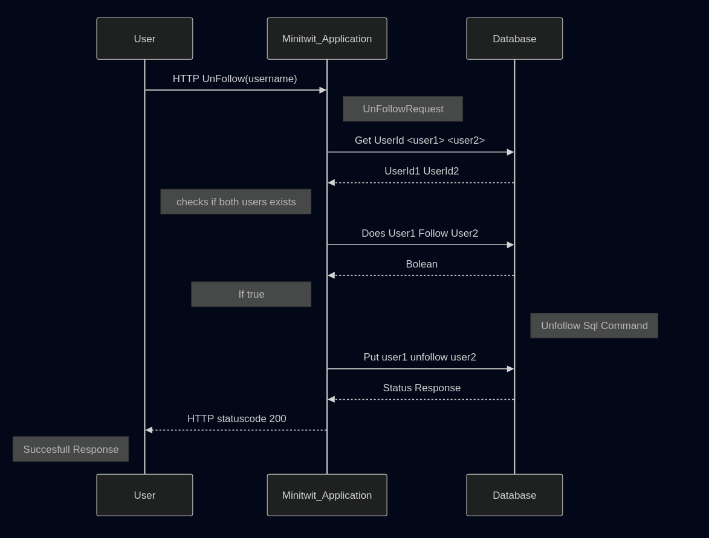
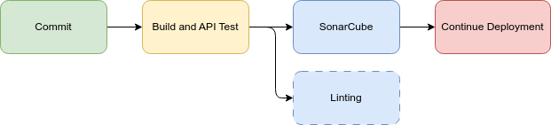
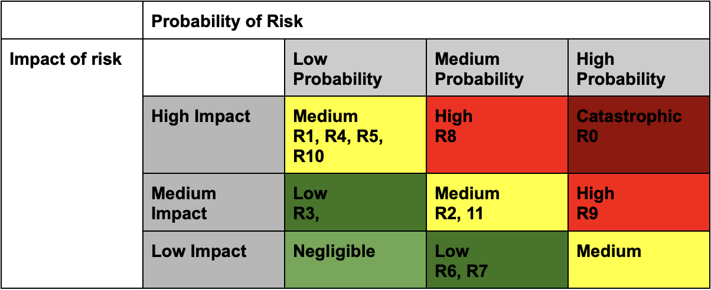

\newpage

# Table of Contents

1. [System's Perspective](#systems-perspective)  
   1.1 [Design and Architecture](#design-and-architecture)  
   1.2 [Dependencies](#dependencies)  
   1.3 [Interactions of Subsystems](#interactions-of-subsystems)  
   1.4 [Current State of the System](#current-state-of-the-system)

2. [Process' Perspective](#process-perspective)  
   2.1 [Deployment and Release](#deployment-and-release)  
   2.2 [Monitoring](#monitoring-1)  
   2.3 [Logging of application](#logging-of-application)  
   2.4 [Security Assessment](#security-assessment)  
   2.5 [Strategy for Scaling and Upgrade](#strategy-for-scaling-and-upgrade)  
   2.6 [The Use of AI](#the-use-of-ai)

3. [Reflection Perspective](#reflection-perspective)  
   3.1 [Evolution and Refactoring](#evolution-and-refactoring)  
   3.2 [Operation](#operation)  
   3.3 [Maintenance](#maintanence)  
   3.4 [DevOps](#devops)

---

\newpage

# System's Perspective

## Design and Architecture

### Static view

The application follows the Onion Architecture and is split into three layers.

- The **Domain Layer** contains the domain model.
- The **Infrastructure Layer** contains the data manipulation and insertion logic.
- The **Application Layer** contains the entrypoint of the applications and defines the endpoints of the API. This layer also contains the UI.


The infrastructure is deployed to Digital Ocean.

- The minitwit application is hosted on two droplets - a primary and secondary.
- A Nginx load balancer distributes load between the two minitwit servers.
- The Database is hosted as a PostgreSQL Database Cluster.
- Logging is hosted on its own separate droplet.


### Infrastructure as Code

The infrastructure above can be deployed with Terraform. The infrastructure as code is documented in the `/terraform` directory.
This includes modules for provisioning the application servers, load balancer and logging stack.

### Dynamic view


**Components**

- **API Controller:** Responsible for receiving incoming requests to the API endpoints and send them to the correct batch service.
- **Batch Service:** Responsible for collecting and processing requests. This is a background service.
- **ORM Layer:** Responsible for translating LINQ into SQL queries.
- **Database:** Responsible for storing data. This involves users, followers and messages.

**Connectors**

- **HTTP:** This connector is the protocol to communicate between the simulator/browser and server.
- **Channel:** This connector is an internal application connector that transfers requests.
- **Npgsql:** The connector is a .NET package that acts as the ORM for PostgreSQL.
- **TCP:** This connector transfers SQL queries to the database.

## Dependencies

Here is a list of all dependencies.

```
# Dependency List:
1. Microsoft.EntityFrameworkCore.Design - Version: 9.0.1
2. Microsoft.Extensions.Configuration - Version: 9.0.2
3. Microsoft.Extensions.Configuration.EnvironmentVariables - Version: 9.0.2
4. Microsoft.Extensions.Configuration.UserSecrets - Version: 9.0.2
5. Npgsql.EntityFrameworkCore.PostgreSQL - Version: 9.0.4
6. prometheus-net - Version: 8.2.1
7. Serilog.AspNetCore - Version: 9.0.0
8. Serilog.Sinks.Console - Version: 6.0.0
9. Microsoft.AspNetCore.Identity - Version: 2.3.1
10. Microsoft.EntityFrameworkCore.Sqlite - Version: 9.0.1
11. Microsoft.AspNetCore.Identity.EntityFrameworkCore - Version: 9.0.1
12. Microsoft.AspNetCore.Identity.UI - Version: 9.0.1
13. Microsoft.EntityFrameworkCore.Tools - Version: 9.0.0
14. Microsoft.VisualStudio.Web.CodeGeneration.Design - Version: 9.0.0
15. prometheus-net.AspNetCore - Version: 8.2.1
16. Serilog - Version: 4.2.0
17. Serilog.Formatting.Compact - Version: 3.0.0
18. Serilog.Sinks.Elasticsearch - Version: 10.0.0
19. Serilog.Sinks.Network - Version: 2.0.2.68
20. Serilog.Sinks.Async - Version: 1.5.0
21. coverlet.collector - Version: 6.0.4
22. Microsoft.AspNetCore.Mvc.Testing - Version: 9.0.2
23. Microsoft.NET.Test.Sdk - Version: 17.13.0
24. Microsoft.Playwright.NUnit - Version: 1.50.0
25. xunit - Version: 2.9.2
26. xunit.runner.visualstudio - Version: 3.0.0
27. Postgres - Version: 16.9
28. Kibana - Version: 8.12.1
29. logstash - Version: 8.12.1
30. elasticsearch - Version: 8.12.1
31. Nginx - Version: 1.27.0
32. Dotnet_SDK - Version: 9.0.0
33. org.Sonarcube - Version: 6.1.0
```

**Logging**

For logging, the application uses Serilog to collect data.
This data is then transferred into the ELK stack, which consists of Logstash, Elasticsearch, and Kibana.
Together they are used to process, query, and display the logging data.
This setup is hidden behind Nginx, which acts as a reverse proxy and serves as an authentication layer between the user and Kibana.

Elasticsearch is accessible at `209.38.112.21:8080. Use "admin" "admin" to login and access logs.

**Monitoring**

For monitoring, the application uses Prometheus for collecting metrics and Grafana for data visualization.
Prometheus scrapes port 5000, the minitwit application, and sends the data to the /metrics endpoint.
Grafana retrieves the necessary data from /metrics.

Grafana is accessible at `164.90.240.84:3000`. The teachers login to access the dashboard.

**Application**

The application is built using .NET.

- **ASP.NET Core Identity** is used for authentication.
- **Entity Framework Core** is used as the object relational mapper.
- **Npgsql** is used to access the PostgreSQL database.
- **NUnit** is used as the primary testing framework, with **Playwright** for end-to-end testing.
- **SonarQube** is used to assess software quality via a GitHub workflow. SonarQube tracks security, reliability, maintainability, test coverage, and code duplication.
- **Hadolint** is used for docker linting and runs on pushes to the main branch to ensure proper Dockerfile syntax.

**Database**  
The initial database was based on SQLite, but was later migrated to PostgreSQL.

**Containerization**  
Docker is used to containerize the application and many of the services.

## Interactions of Subsystems

The diagrams in [@fig:UMLSEQUser] and [@fig:UMLSEQApi] shows how the application handles an unfollow request from both a regular user and the simulator.
The key difference between the two interactions is how the response is returned. For a user a status code 200 is returned when the system is done processing the request.
For the simulator a status code 204 is instantly returned upon receival of the request. The reason for this is elaborated in the reflection section.

{#fig:UMLSEQUser}

{#fig:UMLSEQApi}

## Current State of the System

A quality assessment of the codebase from SonarQube is shown in [@fig:SonarCubeResult].
The system receives an A rating in security, reliability and maintainability. This indicates that the current state of the system is overall acceptable.
One flaw in the system is the lack of testing. The test coverage is only 2.5% and around 1.1k lines is missing coverage. Higher test coverage would make the system less error prone.

Even though the system has multiple minitwit servers, it still has a single point of failure as there only is a single load balancer.
To solve this another load balancer could be added to ensure higher availability.

{#fig:SonarCubeResult}

# Process' perspective

## Deployment and Release

The following workflows are implemented in the CI/CD pipeline:

1. **Build and Test Workflow**  
   Automates the build process and runs all tests.

2. **Build Release Workflow**  
   Automatically creates a release when a new tag is pushed to the repository.

3. **Continuous Deployment Workflow**  
   Deploys the application to the production server upon successful completion of tests and builds.

4. **Lint and Format Check Workflow**  
   Ensures that the code adheres to the project's linting and formatting standards.

5. **Scheduled Release Workflow**  
   Automates weekly releases to ensure regular updates.

6. **SonarQube Workflow**  
   Performs static code analysis using SonarQube to assess the code quality.

Each workflow is defined in the `.github/workflows` directory and is triggered based on specific events such as pushes, pull requests, or scheduled intervals.

## Deployment Chain

The deployment process follows a structured chain format to ensure reliability and minimize downtime. The steps are as follows:

1. **Testing**  
   Once the linting checks pass, the commit undergoes testing to validate that all components work together as expected.

2. **Linting and Code Quality Checks**  
   The code is first analyzed for adherence to linting and formatting standards. This ensures that the codebase remains clean and maintainable.

3. **Deployment with Rolling Updates**  
   If the commit successfully passes all previous stages, the deployment process begins. Rolling updates are utilized to ensure a seamless transition. This approach guarantees that if the deployment encounters any issues, an unaffected backup server remains operational to handle the workload while the problem is resolved.



This deployment strategy ensures high availability and minimizes the risk of service disruption during updates.

## Monitoring

There are two monitoring dashboard that monitors the following:

1. **Request overview dashboard**
   * Average requests per minute
   * Average follow/unfollow requests per minute
   * Average message requests per minute
   * Average register requests per minute
2. **Endpoint dashboard**
   * Register endpoint response duration
   * Follow/Unfollow endpoint response duration
   * Message endpoint response duration

In the `MetricsService.cs` file, there are custom metrics to the application, such as the `minitwit_follow_counter` and `app_request_duration_seconds`.
The follow counter is implemented in the program by adding to the counter, every time a follow request is made.
The duration is measured by starting a timer when a request comes in, and stopping it when the request has been processed.

The graphs in [@fig:monitoring1] and [@fig:monitoring2] shows the two Grafana dashboards populated with data.
They show the change in response time, when going from processing each request, to instantly returning 204.

{#fig:monitoring1}

{#fig:monitoring2}

## Logging of application

In the beginning, the logs contained all logs from the information level and up.
This resulted in a flood of logs, and it was impossible to see anything relevant. It was then configured to only show warnings and above.
Logging statements were added to the code, to log when problems occured.
In the `ApiController.cs` there are custom creation of logs which are logged as warnings.
These logs include system failures such as unsuccessful message post and failure to follow a user.
This data is sent from Serilog to Logstash. Another important metric is logging the request times.
If a request takes longer than 300 ms to process, it will log it. This has been central in discovering the ReadTimeout issue, that the team has struggled with.
To see all the logs for e.g. timeouts, the searchbar is used. Here the user can input "@m: slow", to get all logs about slow requests.

## Security assessment

The Application consists of the following assets:

- Web application (minitwit)
- Monitoring (Prometheus + Grafana)
- Logging (Logstash + Elasticsearch + Kibana)
- DigitalOcean droplets
- DigitalOcean database cluster

**Risk scenarios**

- R0: DDoS attack overwhelms the server, making the application unavailable.

General security:

- R1: Attacker uses exposed secrets to gain access to sensitive data.
- R2: Attacker gains access to our API, and injects large amounts of data into the database, overloading the system.
- R3: An attacker exploits a known vulnerability in an outdated dependency.
- R4: Attacker extracts secrets from unprotected endpoints.

Web application threat sources:

- R5: Attacker performs SQL injection on the web application to download sensitive user data.
- R6: Attacker exploits a cross-site scripting vulnerability to hijack a user sessions.
- R7: Attacker forces or tricks an authenticated user to do unwanted request to the web application. A malicious site sends a request to the trusted website using the user’s cookies and session.
- R8: Attacker can interrupt unencrypted HTTP request and modifies requests.

Infrastructure threat sources:

- R9: An attacker scans for open ports and discovers multiple exposed services.
- R10: An attacker gains SSH access to the droplet and interacts with the running containers.

Monitoring/logging threat sources:

- R11: An attacker gains unauthorized access to Elasticsearch logs and stealing sensitive data.

The above risk scenarios are plotted into the risk matrix shown in [@fig:Risk_matrix] below. 

{#fig:Risk_matrix}

To harden security the application has been made secure against SQL injections.
Secrets are stored privately and secure, and dependencies are up to date.
Access to monitoring and logging is restricted via login and droplets are protected using DigitalOcean’s default security and recommendations for UFW.

The biggest vulnerability is the lack of protection against request spamming and application overloading.
A possible solution to DDoS attacks could be to utilize Nginx on the load balancer. 
Nginx has a "Limit_request_zone feature" which blocks an unusual amount of requests from clients, while still allowing regular users to send requests to the application.
To secure HTTP traffic, HTTPS could be added. To protect open ports, authentication should be required for all exposed services.

## Strategy for scaling and upgrade

The system can be scaled vertically by investing more in the hosting provider, or scaled horizontally by making more server-droplets.

To scale vertically:
1. Upsize the droplets on Digital Ocean.

To scale horizontally:
1. Deploy new application server
2. Add the IP address of the server to load balancer's upstream server list in the configuration file of Nginx.
3. Add the server to the deployment workflow.
4. Add the required secrets to GitHub.
5. Now the new server should be fully integrated into the architecture of the application.

## The use of AI

AI tools such as ChatGPT has been used to assist idea generation and our learning process.
We prioritized receiving help in the exercise sessions from TA's rather than using AI. However, in some cases
when problems occured, and no one knew how to fix it, assistance from AI could be useful.
This approach sometimes sped up development, as it had decent suggestions for common issues.
Contrary, it was sometimes not useful as it did not know the unique circumstances of the problem or overcomplicated it.

# Reflection Perspective

## Evolution and Refactoring

**Migrating from SQLite to Postgres**

To solve this challenge we bought a PostgreSQL database cluster on Digital Ocean, this was to make the process simpler.
For the migration a tool called pgloader was used. This allowed for minimal downtime.

[Link to issue](https://github.com/orgs/Docker-Daze/projects/1/views/1?pane=issue&itemId=101959667&issue=Docker-Daze%7Citu-minitwit%7C18)

**Improving code quality**

After implementing SonarQube quality assessment, a lot of code was refactored and renamed to meet their assessment criteria.
Most of the issues were maintainability, where names did not align in different classes. Another issue was long and complicated functions.
Those functions were refactored, so that a function has one job. The graph in [@fig:sonarqubegraph] show the quality assessment going from 839 to 66 issues after this refactoring.
This improved maintainability and readability of the codebase.

{#fig:sonarqubegraph}

**Securing Elasticsearch**

We received a security notice from DigitalOcean regarding a publicly exposed port on our Elasticsearch instance.
It was a challenge to enable the built-in security features of Elasticsearch, so Nginx was used to secure the port instead.
In the future we should be more aware of which ports are publicly available.

[Link to issue](https://github.com/orgs/Docker-Daze/projects/1?pane=issue&itemId=106037166&issue=Docker-Daze%7Citu-minitwit%7C42)

## Operation

A big issue in the project was getting ReadTimeout from the simulator due to slow processing of requests.
E.g. when a register request failed, all subsequent requests would also fail.
To fix this, the database calls were minimized, SQL queries were combined and a batch service was introduced.
This resulted in fewer requests to the database. However, due to how the batch service was implemented,
the final request in a batch would still receive a ReadTimeout, as it had to wait for all requests in the batch to be processed.
The solution to this was immediately returning a status code 204 while processing the request in the background.

## Maintenance

At one point the Grafana and Prometheus data were gone.
No one knew why it was gone, and it happened at a time, where everyone was working with something different.
This made it difficult to trace why the error occured. Many hours were spent trying to find the issue, and it was finally discovered,
that the snap version of Docker had been installed, over the official version. The snap version saved its volumes somewhere different,
which caused it to look in the wrong place, when looking for the previously saved volumes. The snap version was removed, and all the data was back.
This resulted in an immediate backup of the volumes, so if the volumes were ever removed, the data would not be lost.
After this issue was resolved, it was coincidentally discovered that the droplet only had 1 gb left of storage.
It was therefore upgraded and disaster was avoided.

## DevOps

The automatic linter and quality assessment tool gave insights into, what needed to be changed.
This removed unnecessary human intervention, which saved a lot of development time.
