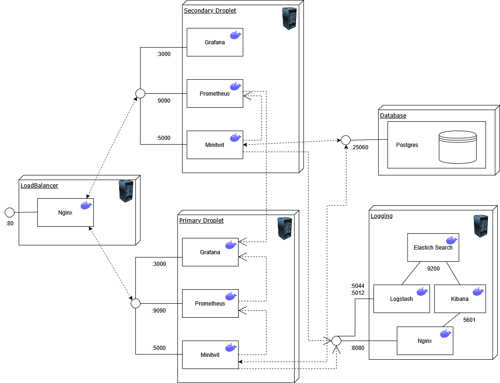
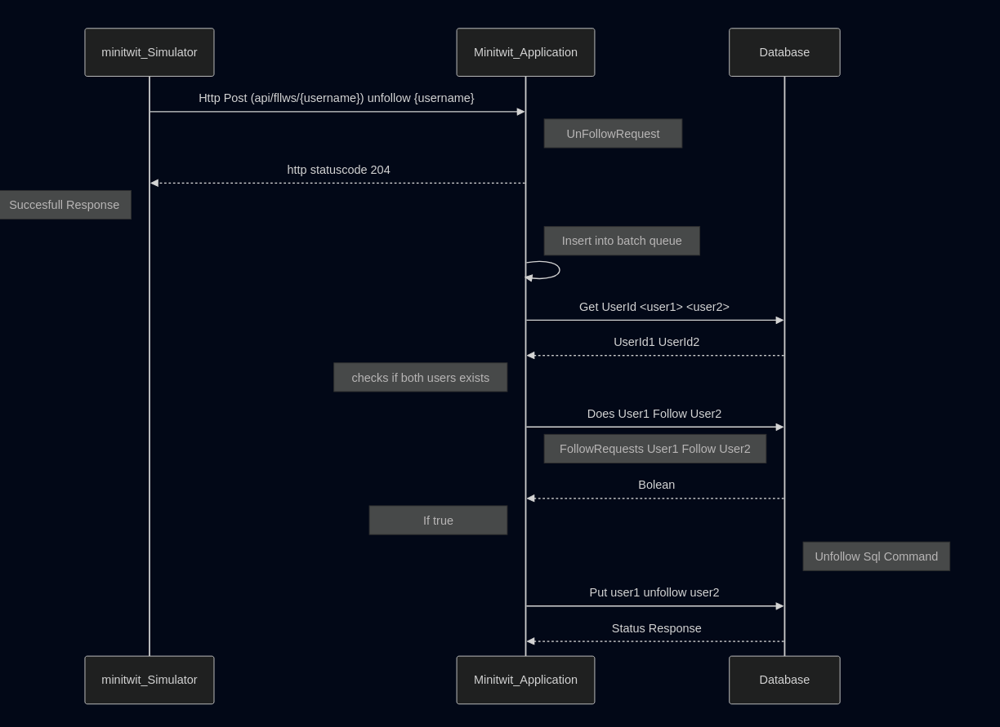

\newpage

# Table of Contents

1. [System's Perspective](#systems-perspective)  
   1.1 [Design and Architecture](#design-and-architecture)  
   1.2 [Dependencies](#dependencies)  
   1.3 [Interactions of Subsystems](#interactions-of-subsystems)  
   1.4 [Current State of the System](#current-state-of-the-system)

2. [Process' Perspective](#process-perspective)  
   2.1 [Deployment and Release](#deployment-and-release)  
   2.2 [Monitoring](#monitoring-1)  
   2.3 [Logging of application](#logging-of-application)  
   2.4 [Security Assessment](#security-assessment)  
   2.5 [Strategy for Scaling and Upgrade](#strategy-for-scaling-and-upgrade)  
   2.6 [The Use of AI](#the-use-of-ai)

3. [Reflection Perspective](#reflection-perspective)  
   3.1 [Evolution and Refactoring](#evolution-and-refactoring)  
   3.2 [Operation](#operation)  
   3.3 [Maintenance](#maintanence)  
   3.4 [DevOps](#devops)

---

\newpage

# System's Perspective

## Design and Architecture

### Static view

The application follows the onion architecture and is split into three layers.

- The **Domain Layer** contains the domain model.
- The **Infrastructure Layer** contains the data manipulation and insertion logic.
- The **Application Layer** contains the entrypoint of the applications and defines the endpoints of the API. This layer also contains the UI.


The infrastructure is deployed to Digital Ocean.

- The minitwit application is hosted on two droplets - a primary and secondary.
- A nginx loadbalancer distributes load between the two minitwit servers.
- The Database is hosted as a PostgreSQL Database Cluster.
- Logging is hosted on its own seperate droplet.



### Infrastruture as Code

The infrastructure above can be deployed with Terraform. The infrastructure as code is documented in the `/terraform` directory.
This includes modules for provisioning the application servers and logging stack.

### Dynamic view

```
/itu-minitwit
    ├── .github/
    │   └── workflows                       # GitHub Action workflows
    │       ├── build-and-test.yml          # Automated build and test
    │       ├── build-release.yml           # Creates release on push with a tag
    │       ├── continous-deployment.yml    # Deployment to dig
    │       ├── lint-and-format-check.yml   # Automated linter and formatting checks
    │       ├── scheduled-release.yml       # Automated weekly release
    │       └── sonarcube.yml               # Automated Sonarcube checks
    ├── logging/                            # Logging configuration files
    │        ├── docker-compose.yml         # Starts ELK stack and nginx containers
    │        └── nginx.conf                 # Reverse proxy with authentication
    ├── logstash/                           # Logstash configuration
    ├── remote_files/                       # Files used remotely on the minitwit server for deployment
    ├── report/                             # Report files
    ├── src/                                # Source code
    │   ├── minitwit.core/                  # Domain Layer - Domain models
    │   ├── minitwit.infrastructure/        # Infrastructure Layer - Data access
    │   └── minitwit.web/                   # Presentation Layer - Web app & API entry point
    │       └── Program.cs                  # Program entrypoint
    ├── terraform/                          # Terraform configurations for provisioning
    │   ├── files/                          # Files used by terraform
    │   ├── modules/
    │   │   ├── minitwit_logging/           # Terraform code for logging infrastucture
    │   │   └── minitwit_server/            # Terraform code for minitwit infrastucture
    │   ├── main.tf                         # Terraform module definitions
    │   ├── terraform.tfvars                # Terraform variables
    │   └── variables.tf                    # Terraform variables declarations
    ├── tests/                              # Test cases
    │   └── minitwit.tests/
    │       ├── minitwit.tests.cs           # API tests
    │       └── playwright.test.cs          # UI tests
    │
    ├── docker-compose.yml                  # For running the program locally
    ├── Dockerfile                          # Application Dockerfile
    └── itu-minitwit.sln                    # Project solution file
```

## Dependencies

```
# Dependency List:
1. Microsoft.EntityFrameworkCore.Design - Version: 9.0.1
2. Microsoft.Extensions.Configuration - Version: 9.0.2
3. Microsoft.Extensions.Configuration.EnvironmentVariables - Version: 9.0.2
4. Microsoft.Extensions.Configuration.UserSecrets - Version: 9.0.2
5. Npgsql.EntityFrameworkCore.PostgreSQL - Version: 9.0.4
6. prometheus-net - Version: 8.2.1
7. Serilog.AspNetCore - Version: 9.0.0
8. Serilog.Sinks.Console - Version: 6.0.0
9. Microsoft.AspNetCore.Identity - Version: 2.3.1
10. Microsoft.EntityFrameworkCore.Sqlite - Version: 9.0.1
11. Microsoft.AspNetCore.Identity.EntityFrameworkCore - Version: 9.0.1
12. Microsoft.AspNetCore.Identity.UI - Version: 9.0.1
13. Microsoft.EntityFrameworkCore.Tools - Version: 9.0.0
14. Microsoft.VisualStudio.Web.CodeGeneration.Design - Version: 9.0.0
15. prometheus-net.AspNetCore - Version: 8.2.1
16. Serilog - Version: 4.2.0
17. Serilog.Formatting.Compact - Version: 3.0.0
18. Serilog.Sinks.Elasticsearch - Version: 10.0.0
19. Serilog.Sinks.Network - Version: 2.0.2.68
20. Serilog.Sinks.Async - Version: 1.5.0
21. coverlet.collector - Version: 6.0.4
22. Microsoft.AspNetCore.Mvc.Testing - Version: 9.0.2
23. Microsoft.NET.Test.Sdk - Version: 17.13.0
24. Microsoft.Playwright.NUnit - Version: 1.50.0
25. xunit - Version: 2.9.2
26. xunit.runner.visualstudio - Version: 3.0.0
27. Postgres - Version: 16.9
28. Kibana - Version: 8.12.1
29. logstash - Version: 8.12.1
30. elasticsearch - Version: 8.12.1
31. Nginx - Version: 1.27.0
32. Dotnet_SDK - Version: 9.0.0
33. org.Sonarcube - Version: 6.1.0
```

#### Logging

For logging, our application uses Serilog as the API to collect log data.
This data is then transferred into the Elastic Stack,
which consists of Logstash, Elasticsearch, and Kibana—all used to process, query, and display the logging data.
his setup is hidden behind Nginx, which acts as a reverse proxy and serves both as a loadbalancer an authentication layer between the user and Kibana (a data visualization and exploration tool).

For elasticsearch "209.38.112.21:8080" use "admin" "admin" to login and access logs.

#### Monitoring

For monitoring, our application uses Prometheus as a real-time metrics storage server.
On top of this, we use Grafana as a data visualization tool to display and analyze these metrics.

For Grafana "164.90.240.84:3000" you can use the given login to access the dashboard.

#### Application

We have built our application using the .NET software framework, following the onion architecture originally invented by Jeffrey Palermo.
We use the ASP.NET Core Identity package as an authentication system, allowing us to create and delete users.
Initially, we used SQLite as our DBMS but later switched to Prometheus.
In both cases, we utilized Entity Framework Core (EF Core) as our Object-Relational Mapper (ORM).
For testing, we use NUnit as the primary testing framework, with Playwright layered on top for end-to-end testing.
To handle API calls from the simulator, we use the ASP.NET Core MVC framework to create API controllers that process HTTP requests.
As a software quality measure, we use SonarQube, specifically integrating their service via a GitHub workflow.
SonarQube tracks security, reliability, maintainability, test coverage, and code duplications.
And for the application we utilize Nginx as a reverse proxy between server. for handling and loadbalancing request to each of our application server for a more stable workload, faster responses and keep our application in a high availabilty state.

## Interactions of Subsystems

User requests and simulator requests are handled differently in our application.
The two main differences between simulator and user requests are as follows:

1. For simulator calls, a status code of 200 is sent immediately after receiving a prompt.
2. simulator prompts are also collected in batches to reduce the number of database calls.

Below, you will see a sequence diagram for an Unfollow requests, from both a user and the simulator

**Sequence Diagram for Simulator unfollow call**


**Sequence Diagram for User unfollow call**


## Current State of the System

The current state of our system is generally good. At all levels of the application, we are observing the results we expect and want.
The biggest weakness in our application is the lack of testing, which is currently close to zero.
Below is the result of a quality check run by our SonarQube workflow.


# Process' perspective -- 1026 words

## Deployment and Release

The following workflows are implemented to ensure a robust CI/CD pipeline:

1. **Build and Test Workflow**  
   This workflow automates the build process and runs all unit and integration tests to ensure code quality.

2. **Build Release Workflow**  
   Automatically creates a release when a new tag is pushed to the repository.

3. **Continuous Deployment Workflow**  
   Deploys the application to the production server upon successful completion of tests and builds.

4. **Lint and Format Check Workflow**  
   Ensures that the code adheres to the project's linting and formatting standards.

5. **Scheduled Release Workflow**  
   Automates weekly releases to ensure regular updates and maintenance.

6. **SonarQube Workflow**  
   Performs static code analysis using SonarQube to identify potential bugs and vulnerabilities.

Each workflow is defined in the `.github/workflows` directory and is triggered based on specific events such as pushes, pull requests, or scheduled intervals.

### Deployment Chain

The deployment process follows a structured chain format to ensure reliability and minimize downtime. The steps are as follows:

1. **Linting and Code Quality Checks**  
   The code is first analyzed for adherence to linting and formatting standards. This ensures that the codebase remains clean and maintainable.

2. **Integration Testing**  
   Once the linting checks pass, the commit undergoes rigorous integration testing to validate that all components work together as expected.

3. **Deployment with Rolling Updates**  
   If the commit successfully passes all previous stages, the deployment process begins. Rolling updates are utilized to ensure a seamless transition. This approach guarantees that if the deployment encounters any issues, an unaffected backup server remains operational to handle the workload while the problem is resolved.


This deployment strategy ensures high availability and minimizes the risk of service disruption during updates.

## Monitoring

The application utilizes Prometheus and Grafana for monitoring. Prometheus scrapes port 5000, the minitwit application, and sends the data to the /metrics endpoint.
Then Grafana retrieves the data from /metrics, and uses this as its data source. The relevant information could however not be found in the default configs .
In the `MetricsService.cs` file, there are custom metrics to our application, such as the "minitwit_follow_counter and "app_request_duration_seconds"
The follow counter is implemented in the program by adding to the counter, every time a follow request is made.
The duration is measured by starting a timer when a request comes in, and stopping it when the request has been processed.

## Logging of application

The application uses the ELK logging stack. In the beginning, the logs contained information from the information level and up.
This resulted in a flood of logs, and it was impossible to see anything relevant. It was then configured to only show warnings and above.
Here there were practically no logs. From here logging statements were added to the code, to log when problems occured.
In the `ApiController.cs` there are custom creation of logs which are logged as warnings.
These logs include system failures such as unsuccessful message post and failure to follow a user.
This data is sent through Serialog to Logstash. Another important metric is logging of request times.
If a request took longer than 300 ms to process, it will log it. This has been central in discovering the ReadTimeout issue, that has occured.
To see all the logs for e.g. timeouts, the searchbar is used. Here the user can input "@m: slow", to get them all.

## Security assessment

The Application is made up of these assets:

- Web application (Minitwit)
- Monitoring (Prometheus + Grafana)
- Logging (Logstash + Elasticsearch + Kibana)
- DigitalOcean droplets
- DigitalOcean database cluster

**Risk scenarios.**

- R0: DDos attack kills the server.

**General security:**

- R1: Attacker uses exposed secrets to gain access to vulnerable data.
- R2: Attacker gains access to our API, and injects huge amounts of data into our database, stressing the system.
- R3: Attacker uses a known exploit in an outdated dependency, exploiting that vulnerability on our system.
- R4: Attacker gets secrets from open endpoints.

**Web application threat sources:**

- R5: Attacker performs SQL injection on our web application to download sensitive user data.
- R6: Attacker exploits a cross-site scripting vulnerability to hijack a user sessions.
- R7: Attacker forces or tricks an authenticated user to do unwanted request to the web application. A malicious site sends a request to the trusted website using the user’s credentials cookies and session.
- R8: Attacker can interrupt unencrypted HTTP request and modify requests.

**Infrastructure threat sources:**

- R9: An attacker scans for open ports and discovers multiple exposed services on our server. The attacker can interact directly with these, which leads to data exposure and disruption of service.
- R10: An attacker scans for open ports and identifies an exposed Elasticsearch instance listening on port 9200. Since the service lacks authentication, the attacker is able to gain access to vulnerable data.
- R11: An attacker SSH into our droplet and interacts with our running containers.

**Monitoring/logging threat sources:**

- R12: Attacker accesses our unauthorized elasticsearch log’s and creates a backup of vulnerable data.


The application is secure against SQL injections. There is no public secrets and dependencies are up to date. Monitoring and loggin requires login to access and droplets are secured by digitaloceans standard security.

The biggest invulnerability is no failsafe against spamming and overloading the application with requests.

A possible solution to DDos attacks is to close the server when a certain amounts of request per minuted exceeds a high number. To secure against attacks on HTTP request is to use HTTPS. To secure open ports is adding authorization to all the ports.

## Strategy for scaling and upgrade

Pay more money to digital ocean.

- A complete description of stages and tools included in the CI/CD chains, including deployment and release of your systems.
- How do you monitor your systems and what precisely do you monitor?
- What do you log in your systems and how do you aggregate logs?
- Brief results of the security assessment and brief description of how did you harden the security of your system based on the analysis.
- Applied strategy for scaling and upgrades.

## The use of AI

AI tools such as Chat GPT was used for idea generation. When problems occured, and no one knew how to fix it,
the AI were asked to see, if an easy fix existed. AI were also used for finding errors in e.g. docker files.
This approach often speeded up development, as it often had great suggestions for common issues.
Sometimes it was also useless, as it was a somewhat "unique" problem, and it did not know how to fix it.
In these cases, the TA's were useful.

# Reflection Perspective -- 445 words

## Evolution and Refactoring

After implementing SonarQube quality assessment, a lot of code was refactored and renamed.
Most of the codes issue was maintainability, where names did not align in different classes.
This was quickly changed everywhere. Next issue was long functions, that did many different things.
This was refactored out, so that one function has one job. This improved maintainability and readability of the code base.

## Operation

The biggest issue this project was the ReadTimeout issues. That meant some requests were lost, and caused problems.
E.g. when a user tried to register, but failed. Then all following message- and follow requests failed.
Many approaches to this was tried. First the Database calls were minimized. Sometimes the database would be called,
when not strictly necessary. This dropped response time by about 30%, but was not enough to actually remove the issue.
Then the sql queries were combined, so only one to two trips were needed pr. request. Then a batch service was introduced,
so requests would only be added to the database, when 10 requests were gathered. Both of these improvements significantly
decreased response time, but on the 10th user, it would insert 10 requests at once, so that 10th users request would often get lost.
In the end it was decided that a status code 200 would be sent back immediately after receiving a request. The request would be processed,
and handled in the background, while the "user" would think everything went fine. The response time dropped to almost 0, and no requests from that point were lost.

## Maintenance

At one point the Grafana and Prometheus data were gone. No one knew why it was gone, and it happened at a time, where everyone was working with something different.
This made it difficult to trace why the error occured. Many hours were spent trying to find the issue, and it was finally discovered,
that the snap version of Docker had been installed, over the official version. The snap version saved its volumes somewhere different,
and caused it to look in the wrong place, when looking for the previous saved volumes. The snap version was removed, and all the data was back.
This resulted in an immediate backup of the volumes, so if the volumes were ever removed, there still was a backup.
After this issue was resolved, it was coincidentally discovered that the droplet only had 1 gb left of storage.
It was therefore upgraded and disaster was avoided.

## DevOps

There was an automatic linter and quality assessment tool, which together gave insights into, what needed to be changed.
This removed unnecessary human intervention, that saved a lot of development time.

title: _minitwit_ Project Report
subtitle: ITU DevOps 2025 Group `E`
author:

- "Magnus Thor Lessing Rolin <thmr@itu.dk>"
- "Mathias Bindslev Hansen <bimh@itu.dk>"
- "Nikolai Tilgreen Nielsen <nitn@itu.dk>"
- "Rasmus Hassing Huge <rahu@itu.dk>"
- "Rasmus Mygind Poulsen <rpou@itu.dk>"
  numbersections: true

---

\newpage

# Table of Contents

1. [System's Perspective](#systems-perspective)  
   1.1 [Design and Architecture](#design-and-architecture)  
   1.2 [Dependencies](#dependencies)  
   1.3 [Interactions of Subsystems](#interactions-of-subsystems)  
   1.4 [Current State of the System](#current-state-of-the-system)

2. [Process' Perspective](#process-perspective)  
   2.1 [Deployment and Release](#deployment-and-release)  
   2.2 [Monitoring](#monitoring-1)  
   2.3 [Logging of application](#logging-of-application)  
   2.4 [Security Assessment](#security-assessment)  
   2.5 [Strategy for Scaling and Upgrade](#strategy-for-scaling-and-upgrade)  
   2.6 [The Use of AI](#the-use-of-ai)

3. [Reflection Perspective](#reflection-perspective)  
   3.1 [Evolution and Refactoring](#evolution-and-refactoring)  
   3.2 [Operation](#operation)  
   3.3 [Maintenance](#maintanence)  
   3.4 [DevOps](#devops)

---

\newpage
